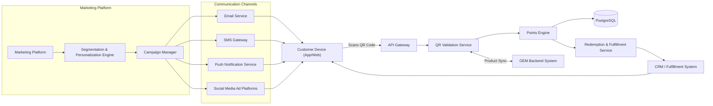
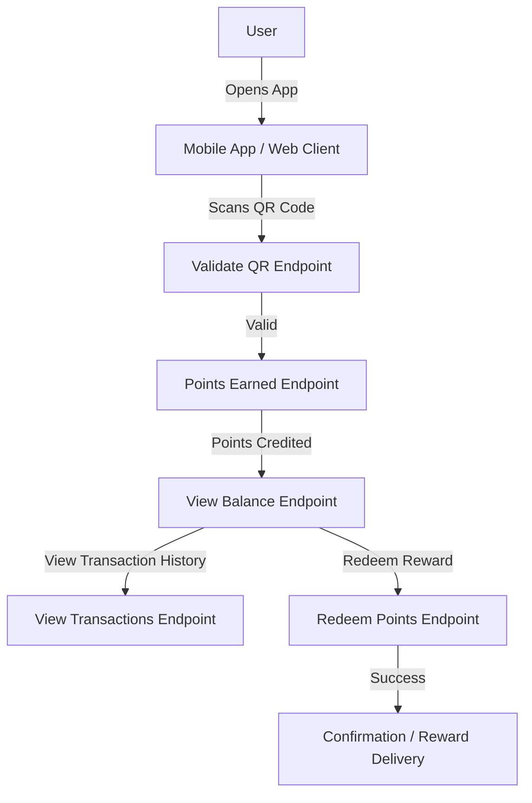

 # System Architecture

 This document describes the high-level architecture of the QRoyalty MVP.

 ```mermaid
 flowchart LR
   subgraph Client Layer
     A[Mobile App / Web Client]
   end
   A -->|HTTPS / REST| B[API Gateway]
   B --> C[QR Service]
   B --> D[Points Service]
   C --> E[(Database)]
   D --> E
   C <-->|Webhooks| F[OEM Backend System]
   E -->|Audit Logs| G[(Logging DB)]
 ```

 - **API Gateway**: Central entry point for all client requests.
 - **QR Service**: Validates QR payloads, ensures authenticity and one-time use semantics.
 - **Points Service**: Executes earning and redemption rules, updates user ledgers.
 - **Database**: Central persistent storage (PostgreSQL).
 - **OEM Backend System**: External system integration for product/catalog sync and transaction webhooks.
 - **Logging DB**: Optional separate store for audit and analytics logs.

## Market Architecture (Customer Focus)

Below is a high-level diagram illustrating how marketing campaigns are created, targeted to customer segments, delivered through various channels, and integrated into the QRoyalty loyalty program for points accrual and redemption:



[📄 Download PDF version of this diagram](market-architecture-customer.pdf)

## User Functional Flow

This flow outlines the typical steps a user takes when interacting with the QRoyalty system:

